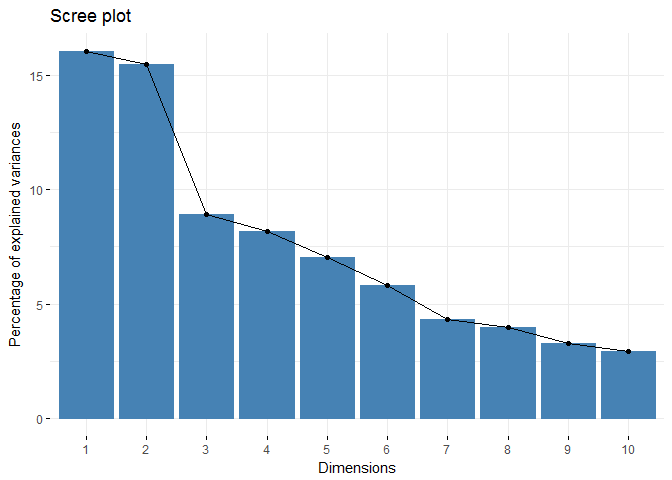

```r
library(data.table)
library(caret)
library(ggplot2)
library(plotly)
library(factoextra)
```

## Executive summary

Using devices such as Jawbone Up, Nike FuelBand, and Fitbit it is now possible to collect a large amount of data about personal activity relatively inexpensively. These type of devices are part of the quantified self movement - a group of enthusiasts who take measurements about themselves regularly to improve their health, to find patterns in their behavior, or because they are tech geeks. One thing that people regularly do is quantify how much of a particular activity they do, but they rarely quantify how well they do it.

In this study, my goal will be to use data from accelerometers on the belt, forearm, arm, and dumbell of 6 participants. They were asked to perform barbell lifts correctly and incorrectly in 5 different ways, and with the data obtained from the accelerometers, I'll develope a predicting model that predicts what specific training way the participant were exercising.

The dataset can be downloaded from here:
[Training Data](https://d396qusza40orc.cloudfront.net/predmachlearn/pml-training.csv)

This dataset was created by:
*Velloso, E.; Bulling, A.; Gellersen, H.; Ugulino, W.; Fuks, H. Qualitative Activity Recognition of Weight Lifting Exercises. Proceedings of 4th International Conference in Cooperation with SIGCHI (Augmented Human '13) . Stuttgart, Germany: ACM SIGCHI, 2013.*

## Data Exploration and Transformation

The first thing we will do is to load the data and do some exploration and cleaning.


```r
dataset <- fread("./pml-training.csv")
```

We want our output variable as a factor, instead of a character variable.


```r
dataset$classe <- factor(dataset$classe)
```

We will remove variables that has no value for predicting, leaving only the data frfom the accelerometers.


```r
dataset$V1 <- NULL
dataset$user_name <- NULL
dataset$raw_timestamp_part_1 <- NULL
dataset$raw_timestamp_part_2 <- NULL
dataset$cvtd_timestamp <- NULL
dataset$new_window <- NULL
dataset$num_window <- NULL
```

The next step will be remove the Near Zero Variability variables. These variables doesn't add any predictive value to our model.


```r
datasmall <- subset(dataset, select = -nearZeroVar(dataset))
```

Finally, we remove all the variables that contains at least a 25% of missing information because can provoque bad model prediction performance.


```r
numNas <- sapply(datasmall, function(x) sum(is.na(x)))
tooManyNAsCols <- names(numNas[numNas > (0.25 * length(datasmall$classe))])
cleandata <- subset(datasmall, select = -which(names(datasmall) %in% tooManyNAsCols))
str(cleandata)
```

```
## Classes 'data.table' and 'data.frame':	19622 obs. of  53 variables:
##  $ roll_belt           : num  1.41 1.41 1.42 1.48 1.48 1.45 1.42 1.42 1.43 1.45 ...
##  $ pitch_belt          : num  8.07 8.07 8.07 8.05 8.07 8.06 8.09 8.13 8.16 8.17 ...
##  $ yaw_belt            : num  -94.4 -94.4 -94.4 -94.4 -94.4 -94.4 -94.4 -94.4 -94.4 -94.4 ...
##  $ total_accel_belt    : int  3 3 3 3 3 3 3 3 3 3 ...
##  $ gyros_belt_x        : num  0 0.02 0 0.02 0.02 0.02 0.02 0.02 0.02 0.03 ...
##  $ gyros_belt_y        : num  0 0 0 0 0.02 0 0 0 0 0 ...
##  $ gyros_belt_z        : num  -0.02 -0.02 -0.02 -0.03 -0.02 -0.02 -0.02 -0.02 -0.02 0 ...
##  $ accel_belt_x        : int  -21 -22 -20 -22 -21 -21 -22 -22 -20 -21 ...
##  $ accel_belt_y        : int  4 4 5 3 2 4 3 4 2 4 ...
##  $ accel_belt_z        : int  22 22 23 21 24 21 21 21 24 22 ...
##  $ magnet_belt_x       : int  -3 -7 -2 -6 -6 0 -4 -2 1 -3 ...
##  $ magnet_belt_y       : int  599 608 600 604 600 603 599 603 602 609 ...
##  $ magnet_belt_z       : int  -313 -311 -305 -310 -302 -312 -311 -313 -312 -308 ...
##  $ roll_arm            : num  -128 -128 -128 -128 -128 -128 -128 -128 -128 -128 ...
##  $ pitch_arm           : num  22.5 22.5 22.5 22.1 22.1 22 21.9 21.8 21.7 21.6 ...
##  $ yaw_arm             : num  -161 -161 -161 -161 -161 -161 -161 -161 -161 -161 ...
##  $ total_accel_arm     : int  34 34 34 34 34 34 34 34 34 34 ...
##  $ gyros_arm_x         : num  0 0.02 0.02 0.02 0 0.02 0 0.02 0.02 0.02 ...
##  $ gyros_arm_y         : num  0 -0.02 -0.02 -0.03 -0.03 -0.03 -0.03 -0.02 -0.03 -0.03 ...
##  $ gyros_arm_z         : num  -0.02 -0.02 -0.02 0.02 0 0 0 0 -0.02 -0.02 ...
##  $ accel_arm_x         : int  -288 -290 -289 -289 -289 -289 -289 -289 -288 -288 ...
##  $ accel_arm_y         : int  109 110 110 111 111 111 111 111 109 110 ...
##  $ accel_arm_z         : int  -123 -125 -126 -123 -123 -122 -125 -124 -122 -124 ...
##  $ magnet_arm_x        : int  -368 -369 -368 -372 -374 -369 -373 -372 -369 -376 ...
##  $ magnet_arm_y        : int  337 337 344 344 337 342 336 338 341 334 ...
##  $ magnet_arm_z        : int  516 513 513 512 506 513 509 510 518 516 ...
##  $ roll_dumbbell       : num  13.1 13.1 12.9 13.4 13.4 ...
##  $ pitch_dumbbell      : num  -70.5 -70.6 -70.3 -70.4 -70.4 ...
##  $ yaw_dumbbell        : num  -84.9 -84.7 -85.1 -84.9 -84.9 ...
##  $ total_accel_dumbbell: int  37 37 37 37 37 37 37 37 37 37 ...
##  $ gyros_dumbbell_x    : num  0 0 0 0 0 0 0 0 0 0 ...
##  $ gyros_dumbbell_y    : num  -0.02 -0.02 -0.02 -0.02 -0.02 -0.02 -0.02 -0.02 -0.02 -0.02 ...
##  $ gyros_dumbbell_z    : num  0 0 0 -0.02 0 0 0 0 0 0 ...
##  $ accel_dumbbell_x    : int  -234 -233 -232 -232 -233 -234 -232 -234 -232 -235 ...
##  $ accel_dumbbell_y    : int  47 47 46 48 48 48 47 46 47 48 ...
##  $ accel_dumbbell_z    : int  -271 -269 -270 -269 -270 -269 -270 -272 -269 -270 ...
##  $ magnet_dumbbell_x   : int  -559 -555 -561 -552 -554 -558 -551 -555 -549 -558 ...
##  $ magnet_dumbbell_y   : int  293 296 298 303 292 294 295 300 292 291 ...
##  $ magnet_dumbbell_z   : num  -65 -64 -63 -60 -68 -66 -70 -74 -65 -69 ...
##  $ roll_forearm        : num  28.4 28.3 28.3 28.1 28 27.9 27.9 27.8 27.7 27.7 ...
##  $ pitch_forearm       : num  -63.9 -63.9 -63.9 -63.9 -63.9 -63.9 -63.9 -63.8 -63.8 -63.8 ...
##  $ yaw_forearm         : num  -153 -153 -152 -152 -152 -152 -152 -152 -152 -152 ...
##  $ total_accel_forearm : int  36 36 36 36 36 36 36 36 36 36 ...
##  $ gyros_forearm_x     : num  0.03 0.02 0.03 0.02 0.02 0.02 0.02 0.02 0.03 0.02 ...
##  $ gyros_forearm_y     : num  0 0 -0.02 -0.02 0 -0.02 0 -0.02 0 0 ...
##  $ gyros_forearm_z     : num  -0.02 -0.02 0 0 -0.02 -0.03 -0.02 0 -0.02 -0.02 ...
##  $ accel_forearm_x     : int  192 192 196 189 189 193 195 193 193 190 ...
##  $ accel_forearm_y     : int  203 203 204 206 206 203 205 205 204 205 ...
##  $ accel_forearm_z     : int  -215 -216 -213 -214 -214 -215 -215 -213 -214 -215 ...
##  $ magnet_forearm_x    : int  -17 -18 -18 -16 -17 -9 -18 -9 -16 -22 ...
##  $ magnet_forearm_y    : num  654 661 658 658 655 660 659 660 653 656 ...
##  $ magnet_forearm_z    : num  476 473 469 469 473 478 470 474 476 473 ...
##  $ classe              : Factor w/ 5 levels "A","B","C","D",..: 1 1 1 1 1 1 1 1 1 1 ...
##  - attr(*, ".internal.selfref")=<externalptr>
```

## Data Modeling

Now that we have a clean dataset we will use Principal Component Analysis(PCA) to take the variables that explains the most variability. But first we divide the data in training and validation.

```r
set.seed(1310)
tr <- createDataPartition(cleandata$classe, p=0.8, list = F)
training <- cleandata[tr, ]
validation <- cleandata[-tr, ]
```

To do the PCA, it is recommendable to scale and center the data, so we will add these methods to our pre-processing call.


```r
pca <- prcomp(training[,-"classe"], center = TRUE, scale. = TRUE)
summary(pca)
```

```
## Importance of components:
##                           PC1    PC2     PC3     PC4     PC5     PC6
## Standard deviation     2.8893 2.8385 2.15590 2.06204 1.91291 1.73612
## Proportion of Variance 0.1605 0.1550 0.08938 0.08177 0.07037 0.05796
## Cumulative Proportion  0.1605 0.3155 0.40487 0.48664 0.55701 0.61497
##                            PC7     PC8     PC9    PC10    PC11    PC12
## Standard deviation     1.49778 1.43751 1.30971 1.23373 1.18004 1.06281
## Proportion of Variance 0.04314 0.03974 0.03299 0.02927 0.02678 0.02172
## Cumulative Proportion  0.65811 0.69785 0.73084 0.76011 0.78689 0.80861
##                          PC13    PC14    PC15    PC16   PC17    PC18
## Standard deviation     0.9967 0.94276 0.91282 0.88626 0.8286 0.76157
## Proportion of Variance 0.0191 0.01709 0.01602 0.01511 0.0132 0.01115
## Cumulative Proportion  0.8277 0.84481 0.86083 0.87594 0.8891 0.90029
##                           PC19    PC20    PC21    PC22    PC23    PC24
## Standard deviation     0.72320 0.69416 0.65050 0.63093 0.61332 0.57944
## Proportion of Variance 0.01006 0.00927 0.00814 0.00766 0.00723 0.00646
## Cumulative Proportion  0.91035 0.91962 0.92776 0.93541 0.94265 0.94910
##                           PC25    PC26    PC27    PC28    PC29    PC30
## Standard deviation     0.55014 0.54084 0.50571 0.48729 0.44781 0.42807
## Proportion of Variance 0.00582 0.00563 0.00492 0.00457 0.00386 0.00352
## Cumulative Proportion  0.95492 0.96055 0.96547 0.97003 0.97389 0.97741
##                           PC31    PC32    PC33    PC34    PC35    PC36
## Standard deviation     0.39711 0.36535 0.34630 0.33768 0.30273 0.28198
## Proportion of Variance 0.00303 0.00257 0.00231 0.00219 0.00176 0.00153
## Cumulative Proportion  0.98045 0.98301 0.98532 0.98751 0.98927 0.99080
##                           PC37    PC38    PC39    PC40    PC41    PC42
## Standard deviation     0.25436 0.23698 0.23449 0.20148 0.19362 0.18500
## Proportion of Variance 0.00124 0.00108 0.00106 0.00078 0.00072 0.00066
## Cumulative Proportion  0.99205 0.99313 0.99418 0.99497 0.99569 0.99634
##                           PC43    PC44    PC45    PC46    PC47    PC48
## Standard deviation     0.18066 0.17130 0.16900 0.16236 0.14693 0.14260
## Proportion of Variance 0.00063 0.00056 0.00055 0.00051 0.00042 0.00039
## Cumulative Proportion  0.99697 0.99754 0.99809 0.99859 0.99901 0.99940
##                           PC49   PC50    PC51    PC52
## Standard deviation     0.11381 0.1010 0.07735 0.04607
## Proportion of Variance 0.00025 0.0002 0.00012 0.00004
## Cumulative Proportion  0.99965 0.9998 0.99996 1.00000
```

```r
fviz_eig(pca)
```

<!-- -->

We can see that the first 2 components already explain more than 30% of the variablitity, and we need only 10 por the 76% of explanation. Even with that, we need at the end 25 principal components to explain the 95% of variability, so we will use those to create our new training dataset.


```r
trainPCA <- predict(pca, training[, -"classe"])
trainPCA <- data.frame(trainPCA[, 1:25], classe = training$classe)
```

Once we have our PCA results, we use the new dataset to train a Random Forest predictive model. To do that we will use a `trainControl` object to tell our method that we want eigth `cross validation` resampling repeats, to improve the final method.


```r
tc <- trainControl(method = "cv", number = 8, verboseIter=FALSE , preProcOptions="pca", allowParallel=TRUE)
randFor <- train(classe ~ ., data = trainPCA, method = "rf", trControl= tc)
```

To finish, we will check the accuracy of our model using the validation partition and the confusion matrix method. To do that, first we have to transform the validation partition using the PCA calculated before.


```r
valiPCA <- predict(pca, validation[, -"classe"])
valiPCA <- data.frame(valiPCA, classe = validation$classe)
confusionMatrix(valiPCA$classe, predict(randFor, valiPCA))
```

```
## Confusion Matrix and Statistics
## 
##           Reference
## Prediction    A    B    C    D    E
##          A 1113    3    0    0    0
##          B   10  741    5    0    3
##          C    5   10  662    5    2
##          D    3    2   22  614    2
##          E    0    1    4    3  713
## 
## Overall Statistics
##                                           
##                Accuracy : 0.9796          
##                  95% CI : (0.9747, 0.9838)
##     No Information Rate : 0.2883          
##     P-Value [Acc > NIR] : < 2.2e-16       
##                                           
##                   Kappa : 0.9742          
##  Mcnemar's Test P-Value : NA              
## 
## Statistics by Class:
## 
##                      Class: A Class: B Class: C Class: D Class: E
## Sensitivity            0.9841   0.9789   0.9553   0.9871   0.9903
## Specificity            0.9989   0.9943   0.9932   0.9912   0.9975
## Pos Pred Value         0.9973   0.9763   0.9678   0.9549   0.9889
## Neg Pred Value         0.9936   0.9949   0.9904   0.9976   0.9978
## Prevalence             0.2883   0.1930   0.1767   0.1586   0.1835
## Detection Rate         0.2837   0.1889   0.1687   0.1565   0.1817
## Detection Prevalence   0.2845   0.1935   0.1744   0.1639   0.1838
## Balanced Accuracy      0.9915   0.9866   0.9742   0.9892   0.9939
```

Our final model, as we can see, gives us a 98% accuracy when testing it against our validation partition; an accuracy that we can consider excellent, finishing with it our study.
